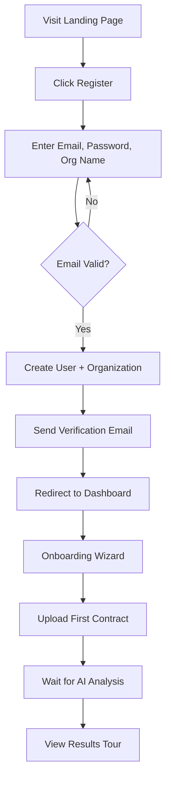
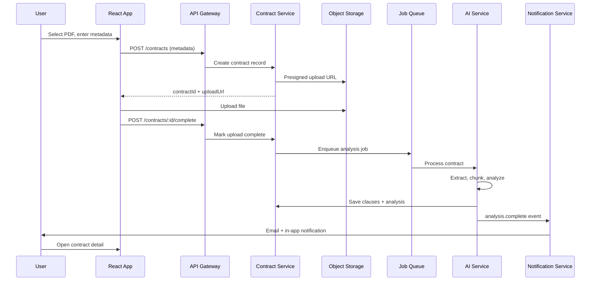

# ContractIQ AI — Software Requirements Specification (SRS)

**Document Version:** 1.0  
**Date:** June 1, 2026  
**Status:** Draft  
**Product:** ContractIQ AI — AI-Powered Legal Contract Analyzer  
**Stack:** MERN (MongoDB, Express.js, React, Node.js) + Microservices

---

## Table of Contents

1. [Project Overview](#1-project-overview)
2. [Business Goals](#2-business-goals)
3. [Functional Requirements](#3-functional-requirements)
4. [Non-Functional Requirements](#4-non-functional-requirements)
5. [User Roles](#5-user-roles)
6. [Complete Feature List](#6-complete-feature-list)
7. [Microservice Architecture](#7-microservice-architecture)
8. [AI Features](#8-ai-features)
9. [Frontend Pages](#9-frontend-pages)
10. [Database Design](#10-database-design)
11. [User Flows](#11-user-flows)
12. [Deployment Architecture](#12-deployment-architecture)

---

## 1. Project Overview

### 1.1 Purpose

ContractIQ AI is a cloud-native legal contract intelligence platform that enables organizations and legal professionals to upload, analyze, compare, and manage contracts using artificial intelligence. The system extracts structured data, identifies risks and obligations, summarizes clauses, and provides actionable insights—reducing manual review time and improving contract governance.

### 1.2 Scope

| In Scope | Out of Scope (Phase 1) |
|----------|------------------------|
| Contract upload (PDF, DOCX) | Court filing or e-signature integration |
| AI-powered clause extraction & risk scoring | Full legal advice / attorney-client relationship |
| Multi-tenant organization workspaces | Blockchain-based contract notarization |
| Role-based access control | On-premise air-gapped deployment |
| Audit trails and version history | Non-English contract analysis (Phase 2) |
| Search, filters, and dashboards | Custom model fine-tuning by end users |

### 1.3 Target Users

- In-house legal teams
- Law firms and paralegals
- Procurement and vendor management
- Compliance officers
- Business stakeholders reviewing vendor agreements

### 1.4 Technology Foundation

| Layer | Technology |
|-------|------------|
| Frontend | React 18+, TypeScript, Vite, Tailwind CSS |
| API Gateway | Node.js / Express or Kong / NGINX |
| Microservices | Node.js (Express), containerized (Docker) |
| Primary Database | MongoDB Atlas (document store) |
| Cache / Queues | Redis, Bull/BullMQ |
| Object Storage | AWS S3 / Azure Blob / MinIO |
| AI / LLM | OpenAI API, Azure OpenAI, or self-hosted models |
| Auth | JWT + refresh tokens, OAuth 2.0 (Google, Microsoft) |
| Observability | Prometheus, Grafana, ELK or OpenTelemetry |

### 1.5 Definitions & Acronyms

| Term | Definition |
|------|------------|
| **Contract** | A legal document uploaded for analysis |
| **Clause** | A discrete section or provision within a contract |
| **Risk Score** | AI-derived numerical assessment of contractual risk |
| **Tenant** | An organization with isolated data and users |
| **MERN** | MongoDB, Express.js, React, Node.js |
| **SRS** | Software Requirements Specification |

---

## 2. Business Goals

### 2.1 Primary Objectives

| ID | Goal | Success Metric |
|----|------|----------------|
| BG-01 | Reduce contract review time by 60%+ | Average time-to-first-insight < 5 minutes per 20-page contract |
| BG-02 | Improve risk visibility | 95% of high-risk clauses flagged in pilot contracts |
| BG-03 | Centralize contract repository | 100% of analyzed contracts searchable within tenant |
| BG-04 | Enable scalable multi-tenant SaaS | Support 500+ organizations on shared infrastructure |
| BG-05 | Ensure auditability for compliance | Immutable audit log for all contract access and AI actions |

### 2.2 Strategic Alignment

- **Efficiency:** Automate repetitive clause identification and summarization.
- **Risk Mitigation:** Surface non-standard terms, liability caps, indemnification, and termination clauses early.
- **Collaboration:** Allow legal and business teams to comment, assign tasks, and approve contracts in one platform.
- **Data-Driven Decisions:** Provide analytics on contract portfolio risk, renewal dates, and obligation deadlines.

### 2.3 Revenue Model (Product Context)

- Freemium tier: limited contracts/month, basic AI summary
- Professional tier: unlimited contracts, advanced risk models, API access
- Enterprise tier: SSO, custom retention, dedicated support, SLA

---

## 3. Functional Requirements

### 3.1 Authentication & Authorization

| ID | Requirement | Priority |
|----|-------------|----------|
| FR-AUTH-01 | Users shall register with email and password | Must |
| FR-AUTH-02 | Users shall log in and receive JWT access + refresh tokens | Must |
| FR-AUTH-03 | System shall support OAuth 2.0 (Google, Microsoft) | Should |
| FR-AUTH-04 | System shall enforce role-based access control (RBAC) per tenant | Must |
| FR-AUTH-05 | Admins shall invite users via email with role assignment | Must |
| FR-AUTH-06 | System shall support password reset via secure email link | Must |
| FR-AUTH-07 | Enterprise tenants shall configure SSO (SAML/OIDC) | Could (Phase 2) |

### 3.2 Organization & Tenant Management

| ID | Requirement | Priority |
|----|-------------|----------|
| FR-TENANT-01 | User shall create or join an organization (tenant) on signup | Must |
| FR-TENANT-02 | Tenant data shall be logically isolated from other tenants | Must |
| FR-TENANT-03 | Tenant admin shall manage members, roles, and billing settings | Must |
| FR-TENANT-04 | Tenant admin shall configure retention policies for contracts | Should |

### 3.3 Contract Ingestion

| ID | Requirement | Priority |
|----|-------------|----------|
| FR-INGEST-01 | User shall upload contracts in PDF and DOCX format (max 50 MB) | Must |
| FR-INGEST-02 | System shall validate file type, size, and malware scan | Must |
| FR-INGEST-03 | System shall extract text via OCR for scanned PDFs | Should |
| FR-INGEST-04 | User shall add metadata: title, counterparty, type, effective date | Must |
| FR-INGEST-05 | System shall support bulk upload (up to 20 files per batch) | Should |
| FR-INGEST-06 | System shall maintain version history per contract | Must |

### 3.4 Contract Analysis (AI)

| ID | Requirement | Priority |
|----|-------------|----------|
| FR-AI-01 | System shall automatically trigger analysis upon upload completion | Must |
| FR-AI-02 | System shall extract and classify clauses by type | Must |
| FR-AI-03 | System shall generate executive summary (≤ 500 words) | Must |
| FR-AI-04 | System shall assign risk score (0–100) with explanation | Must |
| FR-AI-05 | System shall highlight deviations from organization playbook | Should |
| FR-AI-06 | User shall ask natural-language questions about a contract | Must |
| FR-AI-07 | System shall compare two contract versions and show diffs | Should |
| FR-AI-08 | System shall extract key dates (renewal, termination notice) | Must |

### 3.5 Search & Discovery

| ID | Requirement | Priority |
|----|-------------|----------|
| FR-SEARCH-01 | User shall full-text search across tenant contracts | Must |
| FR-SEARCH-02 | User shall filter by status, risk level, type, date, counterparty | Must |
| FR-SEARCH-03 | User shall save and reuse search filters | Could |
| FR-SEARCH-04 | System shall support semantic search via embeddings | Should |

### 3.6 Collaboration & Workflow

| ID | Requirement | Priority |
|----|-------------|----------|
| FR-COLLAB-01 | User shall add comments on contracts and clauses | Must |
| FR-COLLAB-02 | User shall @mention team members in comments | Should |
| FR-COLLAB-03 | User shall assign review tasks with due dates | Should |
| FR-COLLAB-04 | User shall export analysis report (PDF) | Must |
| FR-COLLAB-05 | System shall notify users of assignments and mentions | Must |

### 3.7 Playbooks & Templates

| ID | Requirement | Priority |
|----|-------------|----------|
| FR-PLAYBOOK-01 | Tenant admin shall define standard clause language (playbook) | Should |
| FR-PLAYBOOK-02 | System shall flag clauses that deviate from playbook | Should |
| FR-PLAYBOOK-03 | User shall save contract templates for reuse | Could |

### 3.8 Notifications

| ID | Requirement | Priority |
|----|-------------|----------|
| FR-NOTIF-01 | System shall send in-app notifications | Must |
| FR-NOTIF-02 | System shall send email for critical events (analysis complete, high risk) | Must |
| FR-NOTIF-03 | User shall configure notification preferences | Should |

### 3.9 Billing & Subscription (SaaS)

| ID | Requirement | Priority |
|----|-------------|----------|
| FR-BILLING-01 | System shall integrate with Stripe for subscriptions | Should |
| FR-BILLING-02 | System shall enforce plan limits (contracts/month, seats) | Should |
| FR-BILLING-03 | User shall view usage and upgrade plan | Should |

### 3.10 Administration & Audit

| ID | Requirement | Priority |
|----|-------------|----------|
| FR-AUDIT-01 | System shall log all CRUD operations on contracts | Must |
| FR-AUDIT-02 | System shall log AI inference requests (prompt hash, model, timestamp) | Must |
| FR-AUDIT-03 | Tenant admin shall export audit logs (CSV) | Should |
| FR-AUDIT-04 | Platform super-admin shall manage tenants (suspend, metrics) | Should |

### 3.11 API (External Integrations)

| ID | Requirement | Priority |
|----|-------------|----------|
| FR-API-01 | System shall expose REST API for contract upload and analysis status | Should |
| FR-API-02 | API consumers shall authenticate via API keys scoped to tenant | Should |
| FR-API-03 | System shall provide webhooks for analysis completion events | Could |

---

## 4. Non-Functional Requirements

### 4.1 Performance

| ID | Requirement | Target |
|----|-------------|--------|
| NFR-PERF-01 | API response time (p95) for non-AI endpoints | < 300 ms |
| NFR-PERF-02 | Contract upload acknowledgment | < 2 s |
| NFR-PERF-03 | AI analysis completion (20-page contract) | < 3 minutes (p95) |
| NFR-PERF-04 | Dashboard initial load | < 2 s (LCP) |
| NFR-PERF-05 | Concurrent users per tenant | 100 without degradation |

### 4.2 Scalability

| ID | Requirement | Target |
|----|-------------|--------|
| NFR-SCALE-01 | Horizontal scaling of stateless microservices | Auto-scale 2–20 pods |
| NFR-SCALE-02 | Async job queue for AI workloads | 10,000 jobs/day |
| NFR-SCALE-03 | MongoDB sharding readiness | By tenant_id |

### 4.3 Availability & Reliability

| ID | Requirement | Target |
|----|-------------|--------|
| NFR-AVAIL-01 | Platform uptime SLA (Enterprise) | 99.9% |
| NFR-AVAIL-02 | RPO / RTO for contract data | RPO 1 h, RTO 4 h |
| NFR-AVAIL-03 | Graceful degradation if AI service unavailable | Queue + retry, user notification |

### 4.4 Security

| ID | Requirement | Target |
|----|-------------|--------|
| NFR-SEC-01 | Data encryption at rest | AES-256 |
| NFR-SEC-02 | Data encryption in transit | TLS 1.3 |
| NFR-SEC-03 | Tenant isolation | No cross-tenant data leakage |
| NFR-SEC-04 | Secrets management | Vault / cloud KMS, no secrets in code |
| NFR-SEC-05 | OWASP Top 10 mitigation | Annual penetration test |
| NFR-SEC-06 | PII minimization in AI prompts | Redact where possible |
| NFR-SEC-07 | Session timeout | 30 min idle, configurable for enterprise |

### 4.5 Compliance & Privacy

| ID | Requirement | Target |
|----|-------------|--------|
| NFR-COMP-01 | GDPR-ready data export and deletion | Within 30 days request |
| NFR-COMP-02 | SOC 2 Type II alignment (roadmap) | Phase 2 |
| NFR-COMP-03 | Data residency option (EU/US) | Enterprise tier |
| NFR-COMP-04 | AI disclaimer: not legal advice | Prominent UI + ToS |

### 4.6 Usability

| ID | Requirement | Target |
|----|-------------|--------|
| NFR-UX-01 | WCAG 2.1 Level AA accessibility | Core flows |
| NFR-UX-02 | Responsive design | Desktop, tablet |
| NFR-UX-03 | Onboarding wizard for first contract | < 5 steps |

### 4.7 Maintainability

| ID | Requirement | Target |
|----|-------------|--------|
| NFR-MAINT-01 | Microservice independence | Deploy one service without full outage |
| NFR-MAINT-02 | API versioning | `/api/v1` prefix, backward compatible 12 months |
| NFR-MAINT-03 | Structured logging | JSON logs with correlation ID |

### 4.8 Observability

| ID | Requirement | Target |
|----|-------------|--------|
| NFR-OBS-01 | Distributed tracing | OpenTelemetry across services |
| NFR-OBS-02 | Metrics | Request rate, latency, error rate, queue depth |
| NFR-OBS-03 | Alerting | PagerDuty for P1 incidents |

---

## 5. User Roles

### 5.1 Role Matrix

| Capability | Super Admin | Tenant Admin | Legal Reviewer | Business User | Viewer |
|------------|:-----------:|:------------:|:--------------:|:-------------:|:------:|
| Platform tenant management | ✓ | — | — | — | — |
| Manage tenant users & roles | — | ✓ | — | — | — |
| Configure playbooks | — | ✓ | ✓ | — | — |
| Upload contracts | — | ✓ | ✓ | ✓ | — |
| Run / view AI analysis | — | ✓ | ✓ | ✓ | ✓ |
| Comment & collaborate | — | ✓ | ✓ | ✓ | — |
| Export reports | — | ✓ | ✓ | ✓ | — |
| Delete contracts | — | ✓ | ✓ | — | — |
| View audit logs | — | ✓ | — | — | — |
| Billing management | — | ✓ | — | — | — |
| API key management | — | ✓ | — | — | — |

### 5.2 Role Descriptions

| Role | Description |
|------|-------------|
| **Super Admin** | Platform operator; manages tenants, system health, and global configuration. Not a tenant user. |
| **Tenant Admin** | Organization owner; full control within tenant including users, billing, retention, and playbooks. |
| **Legal Reviewer** | Primary power user; uploads, analyzes, comments, assigns tasks, manages playbooks. |
| **Business User** | Uploads and reviews contracts relevant to their department; limited admin functions. |
| **Viewer** | Read-only access to contracts and analysis shared with them. |

### 5.3 Default Role Assignment

- Organization creator → **Tenant Admin**
- Invited legal staff → **Legal Reviewer**
- Invited procurement / sales → **Business User**
- External counsel (time-limited) → **Viewer**

---

## 6. Complete Feature List

### 6.1 MVP (Phase 1)

| # | Feature | Module |
|---|---------|--------|
| F-01 | Email/password registration & login | Auth |
| F-02 | Organization creation & member invite | Tenant |
| F-03 | JWT session management | Auth |
| F-04 | Contract upload (PDF, DOCX) | Ingestion |
| F-05 | Async AI analysis pipeline | AI |
| F-06 | Clause extraction & classification | AI |
| F-07 | Executive summary generation | AI |
| F-08 | Risk score with breakdown | AI |
| F-09 | Key date extraction | AI |
| F-10 | Contract detail view with highlighted clauses | Frontend |
| F-11 | Natural-language Q&A per contract | AI |
| F-12 | Contract list with search & filters | Search |
| F-13 | Dashboard (counts, recent, high-risk) | Analytics |
| F-14 | Comments on contracts | Collaboration |
| F-15 | In-app & email notifications | Notifications |
| F-16 | PDF export of analysis report | Export |
| F-17 | Audit log (contract access) | Audit |
| F-18 | User profile & settings | User |
| F-19 | Version history on re-upload | Ingestion |
| F-20 | Role-based UI visibility | Auth |

### 6.2 Phase 2

| # | Feature | Module |
|---|---------|--------|
| F-21 | OAuth (Google, Microsoft) | Auth |
| F-22 | SSO (SAML/OIDC) | Auth |
| F-23 | OCR for scanned documents | Ingestion |
| F-24 | Playbook definition & deviation detection | Playbook |
| F-25 | Contract comparison (redline) | AI |
| F-26 | Semantic search | Search |
| F-27 | Bulk upload | Ingestion |
| F-28 | Task assignment & workflow | Collaboration |
| F-29 | Stripe billing & plan limits | Billing |
| F-30 | REST API & API keys | API |
| F-31 | Webhooks | API |
| F-32 | Saved searches | Search |
| F-33 | @mentions in comments | Collaboration |
| F-34 | Custom retention policies | Tenant |
| F-35 | Multi-language support (ES, FR) | AI |

### 6.3 Phase 3

| # | Feature | Module |
|---|---------|--------|
| F-36 | Portfolio analytics & risk heatmap | Analytics |
| F-37 | Obligation calendar & reminders | Calendar |
| F-38 | Template library | Templates |
| F-39 | Custom AI model / fine-tuned playbook | AI |
| F-40 | DMS integrations (SharePoint, Google Drive) | Integrations |
| F-41 | Mobile-responsive PWA | Frontend |
| F-42 | White-label branding (Enterprise) | Tenant |

---

## 7. Microservice Architecture

### 7.1 Architecture Diagram (Logical)

```
                                    ┌─────────────────┐
                                    │   CDN / WAF     │
                                    └────────┬────────┘
                                             │
                                    ┌────────▼────────┐
                                    │  React SPA      │
                                    │  (Static Host)  │
                                    └────────┬────────┘
                                             │ HTTPS
                                    ┌────────▼────────┐
                                    │   API Gateway   │
                                    │ (Rate Limit,    │
                                    │  Auth Verify)   │
                                    └────────┬────────┘
           ┌──────────┬──────────┬─────────┼─────────┬──────────┬──────────┐
           │          │          │         │         │          │          │
    ┌──────▼───┐ ┌────▼────┐ ┌───▼────┐ ┌──▼───┐ ┌───▼────┐ ┌───▼────┐ ┌───▼────┐
    │  Auth    │ │  User   │ │Contract│ │  AI  │ │ Search │ │ Notif  │ │ Audit  │
    │ Service  │ │ Service │ │Service │ │Service│ │Service │ │Service │ │Service │
    └────┬─────┘ └────┬────┘ └───┬────┘ └──┬───┘ └───┬────┘ └───┬────┘ └───┬────┘
         │            │          │         │         │          │          │
         └────────────┴──────────┴────┬────┴─────────┴──────────┴──────────┘
                                      │
              ┌───────────────────────┼───────────────────────┐
              │                       │                       │
       ┌──────▼──────┐         ┌──────▼──────┐         ┌──────▼──────┐
       │   MongoDB   │         │    Redis    │         │  S3/Blob    │
       │   Cluster   │         │ Cache/Queue │         │  Storage    │
       └─────────────┘         └─────────────┘         └─────────────┘
                                      │
                              ┌───────▼───────┐
                              │  LLM Provider │
                              │ (OpenAI/Azure)│
                              └───────────────┘
```

### 7.2 Service Catalog

| Service | Responsibility | Database | Communication |
|---------|----------------|----------|---------------|
| **API Gateway** | Routing, JWT validation, rate limiting, request logging | — | REST to all services |
| **Auth Service** | Register, login, refresh, OAuth, password reset | `users`, `sessions` | REST, publishes `user.created` |
| **User Service** | Profiles, preferences, tenant membership | `users`, `memberships` | REST, consumes auth events |
| **Contract Service** | Upload metadata, versions, status, CRUD | `contracts`, `versions` | REST, S3 presigned URLs, publishes `contract.uploaded` |
| **Ingestion Worker** | Text extraction, OCR, chunking | — | Consumes queue, calls Contract + AI |
| **AI Service** | Summaries, clauses, risk, Q&A, embeddings | `analyses`, `clauses` | REST + async queue, calls LLM |
| **Search Service** | Full-text + vector search | Elasticsearch or MongoDB Atlas Search | REST, indexes from events |
| **Notification Service** | Email, in-app notifications | `notifications` | REST, consumes domain events |
| **Audit Service** | Immutable audit trail | `audit_logs` | REST, consumes all write events |
| **Billing Service** | Stripe webhooks, usage metering | `subscriptions`, `usage` | REST (Phase 2) |
| **Playbook Service** | Standard clauses, deviation rules | `playbooks` | REST (Phase 2) |

### 7.3 Inter-Service Communication

| Pattern | Use Case |
|---------|----------|
| **Synchronous REST** | User-facing CRUD, auth checks, immediate reads |
| **Async Message Queue (Redis/Bull)** | AI analysis, OCR, indexing, email send |
| **Event Bus (optional Phase 2)** | RabbitMQ/Kafka for `contract.analyzed`, `user.invited` |
| **Saga / Compensation** | Upload fails → rollback metadata, delete S3 object |

### 7.4 API Gateway Routes (Example)

| Route Prefix | Target Service |
|--------------|----------------|
| `/api/v1/auth/*` | Auth Service |
| `/api/v1/users/*` | User Service |
| `/api/v1/contracts/*` | Contract Service |
| `/api/v1/analysis/*` | AI Service |
| `/api/v1/search/*` | Search Service |
| `/api/v1/notifications/*` | Notification Service |
| `/api/v1/audit/*` | Audit Service |
| `/api/v1/organizations/*` | User Service (tenant) |

### 7.5 Shared Cross-Cutting Concerns

- **Correlation ID:** `X-Request-ID` propagated across all services
- **Tenant Context:** `X-Tenant-ID` extracted from JWT, enforced in every query
- **Service-to-Service Auth:** Internal mTLS or signed service tokens
- **Circuit Breaker:** AI and external LLM calls with fallback messaging

---

## 8. AI Features

### 8.1 AI Capability Overview

| Feature | Input | Output | Model Approach |
|---------|-------|--------|----------------|
| Text extraction | PDF/DOCX bytes | Plain text + structure | pdf-parse, mammoth, Tesseract OCR |
| Clause segmentation | Full contract text | Array of clauses with offsets | LLM + rule-based section detection |
| Clause classification | Clause text | Type (indemnity, termination, IP, etc.) | LLM classification with taxonomy |
| Executive summary | Full contract + clauses | Narrative summary | LLM (GPT-4 class) |
| Risk scoring | Clauses + playbook (optional) | Score 0–100 + factors | LLM + weighted rubric |
| Key date extraction | Contract text | Structured dates with labels | LLM + regex validation |
| Playbook deviation | Clause vs playbook standard | Pass/fail + suggested language | Embedding similarity + LLM |
| Contract Q&A | User question + RAG context | Answer with citations | RAG over chunked embeddings |
| Version comparison | Two contract texts | Diff summary + changed clauses | LLM diff + textual diff |
| Semantic search | Natural language query | Ranked contract snippets | Vector embeddings (ada-002 or equivalent) |

### 8.2 AI Processing Pipeline

```
Upload Complete
      │
      ▼
┌─────────────┐     ┌──────────────┐     ┌─────────────┐
│  Extract    │────▶│   Chunk &    │────▶│  Embed &    │
│  Text/OCR   │     │   Structure  │     │  Index      │
└─────────────┘     └──────────────┘     └─────────────┘
      │                                            │
      ▼                                            ▼
┌─────────────┐     ┌──────────────┐     ┌─────────────┐
│  Segment    │────▶│  Classify    │────▶│  Risk Score │
│  Clauses    │     │  Clauses     │     │  & Summary  │
└─────────────┘     └──────────────┘     └─────────────┘
      │
      ▼
 Status: COMPLETED → Notify User
```

### 8.3 Clause Taxonomy (Standard Types)

- Parties & Definitions
- Term & Termination
- Payment & Fees
- Confidentiality
- Intellectual Property
- Indemnification
- Limitation of Liability
- Warranties & Disclaimers
- Governing Law & Dispute Resolution
- Assignment & Change of Control
- Force Majeure
- Data Protection / Privacy
- Non-Compete / Non-Solicit
- Insurance
- Miscellaneous (Notices, Entire Agreement, Amendments)

### 8.4 Risk Scoring Rubric

| Factor | Weight | Description |
|--------|--------|-------------|
| Liability exposure | 25% | Uncapped liability, broad indemnity |
| Termination flexibility | 20% | One-sided termination, auto-renewal traps |
| IP ownership | 15% | Work-for-hire, broad license grants |
| Data & privacy | 15% | Weak DPA, cross-border transfer |
| Payment terms | 10% | Net-90, penalties, audit rights |
| Non-standard clauses | 15% | Deviation from playbook |

**Risk Bands:** Low (0–33) | Medium (34–66) | High (67–100)

### 8.5 RAG Architecture (Q&A)

1. Chunk contract text (~500 tokens, 50 token overlap)
2. Generate embeddings per chunk; store in vector DB (MongoDB Atlas Vector Search or Pinecone)
3. On user question: embed query → retrieve top-k chunks → LLM answer with `[Clause X, Page Y]` citations
4. Refuse to answer if confidence low; suggest human review

### 8.6 AI Safety & Guardrails

- System prompt: "You assist with contract review; you do not provide legal advice."
- PII redaction optional pre-processing for logs
- Token limits per request; truncate with user warning
- Human-in-the-loop disclaimer on all AI outputs
- Log prompt hashes (not full text) for audit in production
- Rate limit AI calls per tenant plan

### 8.7 Model Configuration

| Use Case | Recommended Model Tier | Max Tokens |
|----------|------------------------|------------|
| Summary & risk | High-capability (GPT-4o) | 8K output |
| Classification | Mid-tier or fine-tuned | 2K output |
| Q&A (RAG) | High-capability | 4K output |
| Embeddings | text-embedding-3-small | — |

---

## 9. Frontend Pages

### 9.1 Public (Unauthenticated)

| Route | Page | Description |
|-------|------|-------------|
| `/` | Landing | Product value prop, features, CTA to register |
| `/pricing` | Pricing | Plan comparison table |
| `/login` | Login | Email/password + OAuth buttons |
| `/register` | Register | Account + organization creation |
| `/forgot-password` | Forgot Password | Email input, reset link |
| `/reset-password/:token` | Reset Password | New password form |
| `/terms` | Terms of Service | Legal terms |
| `/privacy` | Privacy Policy | Privacy policy |

### 9.2 Authenticated Application

| Route | Page | Description |
|-------|------|-------------|
| `/app/dashboard` | Dashboard | KPIs, recent contracts, high-risk alerts, upcoming dates |
| `/app/contracts` | Contract List | Table/grid with search, filters, bulk actions |
| `/app/contracts/upload` | Upload | Drag-drop, metadata form, bulk upload |
| `/app/contracts/:id` | Contract Detail | Tabs: Overview, Clauses, Risk, Q&A, Comments, History |
| `/app/contracts/:id/clauses/:clauseId` | Clause Detail | Full text, classification, risk note, playbook compare |
| `/app/contracts/compare` | Compare | Select two versions/contracts, side-by-side diff |
| `/app/search` | Advanced Search | Full-text + semantic search results |
| `/app/playbooks` | Playbooks | List and edit standard clauses (Phase 2) |
| `/app/playbooks/:id` | Playbook Editor | CRUD playbook rules |
| `/app/tasks` | Tasks | Assigned reviews, due dates (Phase 2) |
| `/app/notifications` | Notifications | In-app notification center |
| `/app/analytics` | Analytics | Portfolio risk, trends (Phase 3) |
| `/app/settings/profile` | Profile | Name, avatar, password |
| `/app/settings/organization` | Organization | Members, roles, invites |
| `/app/settings/billing` | Billing | Plan, usage, payment method (Phase 2) |
| `/app/settings/notifications` | Notification Prefs | Email/in-app toggles |
| `/app/settings/api` | API Keys | Generate/revoke keys (Phase 2) |
| `/app/settings/audit` | Audit Log | Filterable audit trail (Tenant Admin) |
| `/app/admin/tenants` | Platform Admin | Tenant list, suspend (Super Admin only) |

### 9.3 Contract Detail Tab Structure

| Tab | Content |
|-----|---------|
| **Overview** | Summary, risk gauge, key dates, metadata, export button |
| **Clauses** | Filterable clause list with type badges and risk indicators |
| **Risk Analysis** | Score breakdown, factor explanations, recommendations |
| **Ask AI** | Chat interface with cited answers |
| **Comments** | Threaded discussion |
| **Versions** | Version timeline, download, compare |
| **Activity** | Audit events for this contract |

### 9.4 UI/UX Principles

- Legal-professional aesthetic: clean typography, high information density
- Risk visualization: color-coded badges (green/yellow/red)
- Progressive disclosure: summary first, drill into clauses
- Accessible forms and keyboard navigation
- Loading states for async AI (skeleton + progress %)

---

## 10. Database Design

### 10.1 Database Strategy

- **Primary store:** MongoDB (document-oriented, flexible schema for AI outputs)
- **Tenant isolation:** Every collection document includes `tenantId`; compound indexes start with `tenantId`
- **File blobs:** Stored in object storage; MongoDB stores URL and metadata only
- **Search index:** Elasticsearch or MongoDB Atlas Search synced via events
- **Vector embeddings:** MongoDB Atlas Vector Search or dedicated vector DB

### 10.2 Entity Relationship (Conceptual)

```
Organization (1) ──── (N) Membership (N) ──── (1) User
      │
      ├──── (N) Contract ──── (N) ContractVersion
      │              │
      │              ├──── (N) Clause
      │              ├──── (1) Analysis
      │              ├──── (N) Comment
      │              └──── (N) EmbeddingChunk
      │
      ├──── (N) Playbook
      ├──── (N) Notification
      ├──── (N) AuditLog
      └──── (1) Subscription
```

### 10.3 Collection Schemas (Logical)

#### `organizations`

| Field | Type | Notes |
|-------|------|-------|
| `_id` | ObjectId | PK |
| `name` | String | Required |
| `slug` | String | Unique, URL-friendly |
| `plan` | Enum | free, pro, enterprise |
| `settings` | Object | retentionDays, allowedDomains |
| `createdAt` | Date | |
| `updatedAt` | Date | |

#### `users`

| Field | Type | Notes |
|-------|------|-------|
| `_id` | ObjectId | PK |
| `email` | String | Unique, indexed |
| `passwordHash` | String | bcrypt |
| `firstName`, `lastName` | String | |
| `avatarUrl` | String | Optional |
| `isSuperAdmin` | Boolean | Default false |
| `emailVerified` | Boolean | |
| `createdAt`, `updatedAt` | Date | |

#### `memberships`

| Field | Type | Notes |
|-------|------|-------|
| `_id` | ObjectId | PK |
| `tenantId` | ObjectId | FK → organizations |
| `userId` | ObjectId | FK → users |
| `role` | Enum | tenant_admin, legal_reviewer, business_user, viewer |
| `status` | Enum | active, invited, suspended |
| `invitedAt`, `joinedAt` | Date | |

**Index:** `{ tenantId: 1, userId: 1 }` unique

#### `contracts`

| Field | Type | Notes |
|-------|------|-------|
| `_id` | ObjectId | PK |
| `tenantId` | ObjectId | Required, indexed |
| `title` | String | |
| `counterparty` | String | |
| `contractType` | Enum | nda, msa, sow, employment, vendor, other |
| `status` | Enum | uploading, processing, analyzed, failed |
| `currentVersionId` | ObjectId | |
| `riskScore` | Number | 0–100, denormalized |
| `riskLevel` | Enum | low, medium, high |
| `keyDates` | Array | `{ label, date, sourceClauseId }` |
| `tags` | [String] | |
| `createdBy` | ObjectId | |
| `createdAt`, `updatedAt` | Date | |

**Indexes:** `{ tenantId: 1, status: 1 }`, `{ tenantId: 1, riskLevel: 1 }`, text index on title/counterparty

#### `contract_versions`

| Field | Type | Notes |
|-------|------|-------|
| `_id` | ObjectId | PK |
| `contractId` | ObjectId | |
| `tenantId` | ObjectId | |
| `versionNumber` | Number | Incremental |
| `fileName` | String | |
| `fileSize` | Number | Bytes |
| `mimeType` | String | |
| `storageKey` | String | S3 key |
| `extractedText` | String | Optional, large |
| `pageCount` | Number | |
| `uploadedBy` | ObjectId | |
| `uploadedAt` | Date | |

#### `analyses`

| Field | Type | Notes |
|-------|------|-------|
| `_id` | ObjectId | PK |
| `contractId` | ObjectId | |
| `versionId` | ObjectId | |
| `tenantId` | ObjectId | |
| `status` | Enum | pending, processing, completed, failed |
| `summary` | String | Executive summary |
| `riskScore` | Number | |
| `riskFactors` | Array | `{ factor, weight, score, explanation }` |
| `modelUsed` | String | e.g. gpt-4o |
| `tokensUsed` | Number | |
| `processingTimeMs` | Number | |
| `errorMessage` | String | If failed |
| `completedAt` | Date | |

#### `clauses`

| Field | Type | Notes |
|-------|------|-------|
| `_id` | ObjectId | PK |
| `contractId` | ObjectId | |
| `versionId` | ObjectId | |
| `tenantId` | ObjectId | |
| `clauseType` | String | From taxonomy |
| `title` | String | |
| `text` | String | Full clause text |
| `startOffset`, `endOffset` | Number | Position in document |
| `pageNumber` | Number | Optional |
| `riskLevel` | Enum | low, medium, high |
| `riskNote` | String | AI explanation |
| `playbookDeviation` | Boolean | Phase 2 |
| `orderIndex` | Number | Display order |

#### `embedding_chunks`

| Field | Type | Notes |
|-------|------|-------|
| `_id` | ObjectId | PK |
| `contractId` | ObjectId | |
| `tenantId` | ObjectId | |
| `chunkIndex` | Number | |
| `text` | String | |
| `embedding` | Array[Float] | Vector |
| `metadata` | Object | page, clauseId |

#### `comments`

| Field | Type | Notes |
|-------|------|-------|
| `_id` | ObjectId | PK |
| `contractId` | ObjectId | |
| `clauseId` | ObjectId | Optional |
| `tenantId` | ObjectId | |
| `userId` | ObjectId | |
| `body` | String | |
| `mentions` | [ObjectId] | Phase 2 |
| `createdAt`, `updatedAt` | Date | |

#### `notifications`

| Field | Type | Notes |
|-------|------|-------|
| `_id` | ObjectId | PK |
| `tenantId` | ObjectId | |
| `userId` | ObjectId | |
| `type` | Enum | analysis_complete, high_risk, mention, task_assigned |
| `title`, `body` | String | |
| `resourceType`, `resourceId` | String, ObjectId | |
| `read` | Boolean | Default false |
| `createdAt` | Date | |

#### `audit_logs` (append-only)

| Field | Type | Notes |
|-------|------|-------|
| `_id` | ObjectId | PK |
| `tenantId` | ObjectId | |
| `userId` | ObjectId | Nullable (system) |
| `action` | String | contract.upload, contract.view, analysis.run |
| `resourceType` | String | |
| `resourceId` | ObjectId | |
| `metadata` | Object | IP, userAgent, changes |
| `timestamp` | Date | TTL index optional per retention |

#### `playbooks` (Phase 2)

| Field | Type | Notes |
|-------|------|-------|
| `_id` | ObjectId | PK |
| `tenantId` | ObjectId | |
| `name` | String | |
| `clauseRules` | Array | `{ clauseType, standardText, severity }` |
| `isDefault` | Boolean | |
| `createdAt`, `updatedAt` | Date | |

#### `subscriptions` (Phase 2)

| Field | Type | Notes |
|-------|------|-------|
| `_id` | ObjectId | PK |
| `tenantId` | ObjectId | Unique |
| `stripeCustomerId` | String | |
| `stripeSubscriptionId` | String | |
| `plan` | Enum | |
| `status` | Enum | active, canceled, past_due |
| `currentPeriodEnd` | Date | |
| `usage` | Object | contractsThisMonth, aiTokensUsed |

### 10.4 Data Retention

| Data Type | Default Retention | Configurable |
|-----------|-------------------|--------------|
| Contracts & analysis | Duration of subscription + 30 days | Yes (Enterprise) |
| Audit logs | 7 years | Yes |
| AI prompt logs | 90 days (hashed) | No |
| Deleted tenant data | Hard delete within 30 days of request | GDPR |

---

## 11. User Flows

### 11.1 New User Registration & Onboarding



**Steps:**
1. User registers with email, password, and organization name.
2. System creates `User`, `Organization`, and `Membership` (role: Tenant Admin).
3. User lands on dashboard with onboarding checklist.
4. Wizard guides first contract upload and explains risk score.

### 11.2 Contract Upload & Analysis



### 11.3 Contract Review (Legal Reviewer)

1. Open **Contract List** → filter by `riskLevel: high`.
2. Select contract → review **Overview** tab (summary + risk gauge).
3. Navigate to **Clauses** tab → sort by risk → read flagged clauses.
4. Use **Ask AI** to clarify ambiguous indemnity language.
5. Add **Comments** on specific clauses for business team.
6. **Export PDF** report for internal records.
7. Mark review complete (Phase 2: task workflow).

### 11.4 Natural Language Q&A

1. User opens contract → **Ask AI** tab.
2. User types: "What is the termination notice period?"
3. Frontend sends question + `contractId` to AI Service.
4. AI Service retrieves relevant chunks (RAG) → generates answer with citations.
5. UI displays answer with clickable clause references.
6. Interaction logged in audit trail.

### 11.5 Member Invite Flow

1. Tenant Admin → **Settings → Organization → Invite Member**.
2. Enter email and select role.
3. System creates pending `Membership` and sends invite email.
4. Invitee clicks link → registers or logs in → auto-joined to tenant.
5. Audit log records `member.invited` and `member.joined`.

### 11.6 Password Reset Flow

1. User clicks **Forgot Password** → enters email.
2. Auth Service generates time-limited token (1 hour) → sends email.
3. User clicks link → sets new password.
4. All refresh tokens invalidated.

### 11.7 Failed Analysis Recovery

1. AI job fails (timeout, LLM error, corrupt PDF).
2. Contract `status` → `failed`; user sees error message.
3. User may re-upload or click **Retry Analysis**.
4. System re-queues job (max 3 retries with exponential backoff).

---

## 12. Deployment Architecture

### 12.1 Environment Tiers

| Environment | Purpose | Infrastructure |
|-------------|---------|----------------|
| **Development** | Local dev | Docker Compose, MinIO, local MongoDB |
| **Staging** | QA, integration tests | Kubernetes (single region), shared LLM quota |
| **Production** | Live customers | Kubernetes multi-AZ, managed MongoDB Atlas |

### 12.2 Production Architecture Diagram

```
                         ┌──────────────────────────────────────────┐
                         │              Cloud Provider               │
                         │  (AWS / Azure / GCP)                      │
                         └──────────────────────────────────────────┘
    Users ──▶ Route 53 / Traffic Manager ──▶ CloudFront / CDN
                                              │
                                              ▶ WAF (OWASP rules)
                                              │
                         ┌────────────────────▼────────────────────┐
                         │     Application Load Balancer (HTTPS)   │
                         └────────────────────┬────────────────────┘
                                              │
              ┌───────────────────────────────┼───────────────────────────────┐
              │                    Kubernetes Cluster (EKS/AKS)                │
              │  ┌─────────────┐  ┌─────────────┐  ┌─────────────┐              │
              │  │ API Gateway │  │ Auth Svc    │  │ Contract Svc│  ...         │
              │  │  (3 pods)   │  │  (2 pods)   │  │  (3 pods)   │              │
              │  └─────────────┘  └─────────────┘  └─────────────┘              │
              │  ┌─────────────┐  ┌─────────────┐                               │
              │  │ AI Workers  │  │ Ingestion   │  HPA on CPU / queue depth     │
              │  │  (2-10 pods)│  │ Workers     │                               │
              │  └─────────────┘  └─────────────┘                               │
              └───────────────────────────────┬───────────────────────────────┘
                                              │
         ┌────────────────┬───────────────────┼───────────────────┬────────────────┐
         │                │                   │                   │                │
    ┌────▼────┐     ┌─────▼─────┐      ┌──────▼──────┐     ┌──────▼──────┐  ┌─────▼─────┐
    │ MongoDB │     │   Redis   │      │  S3 Bucket  │     │  Secrets    │  │ OpenAI /  │
    │ Atlas   │     │ ElastiCache│     │  (encrypted)│     │  Manager    │  │ Azure OAI │
    │ Multi-AZ│     │           │      │             │     │             │  │           │
    └─────────┘     └───────────┘      └─────────────┘     └─────────────┘  └───────────┘
```

### 12.3 CI/CD Pipeline

| Stage | Actions |
|-------|---------|
| **Commit** | Lint, unit tests, SAST (SonarQube) |
| **PR** | Integration tests, contract tests between services |
| **Merge to main** | Build Docker images → push to ECR/ACR |
| **Deploy Staging** | Helm upgrade staging → smoke tests |
| **Deploy Production** | Manual approval → blue/green or rolling update |
| **Post-deploy** | Synthetic health checks, rollback on failure |

### 12.4 Container & Orchestration

| Component | Specification |
|-----------|---------------|
| Base image | `node:20-alpine` |
| Orchestrator | Kubernetes 1.28+ |
| Ingress | NGINX Ingress Controller |
| Package manager | Helm charts per microservice |
| Autoscaling | HPA: CPU > 70% or custom metric (queue length) |
| AI Workers | Separate deployment; scale 2–10 based on Bull queue depth |

### 12.5 Networking & Security

| Control | Implementation |
|---------|----------------|
| TLS termination | ALB + cert-manager (Let's Encrypt) |
| Private subnets | Microservices and databases not public |
| Network policies | K8s NetworkPolicy: deny all, allow explicit |
| Egress | AI service only egress to LLM API endpoints |
| IAM | IRSA (AWS) / Workload Identity (GCP) for S3 access |

### 12.6 Disaster Recovery & Backup

| Asset | Backup Strategy | Frequency |
|-------|-----------------|-----------|
| MongoDB Atlas | Continuous cloud backup | Point-in-time restore |
| S3 contracts | Cross-region replication | Real-time |
| Redis | Snapshot (non-critical cache) | Daily |
| Kubernetes config | GitOps (ArgoCD) | Every commit |

### 12.7 Monitoring Stack

| Tool | Purpose |
|------|---------|
| Prometheus + Grafana | Metrics dashboards, SLIs |
| Loki or ELK | Log aggregation |
| Jaeger / Tempo | Distributed tracing |
| PagerDuty | Incident alerting |
| UptimeRobot / synthetic | External availability checks |

### 12.8 Estimated Initial Sizing (Production MVP)

| Resource | Specification |
|----------|---------------|
| K8s nodes | 3 × `m5.large` (or equivalent) |
| MongoDB Atlas | M10 cluster, 3-node replica set |
| Redis | 1 GB cache instance |
| S3 | Standard tier, lifecycle to IA after 90 days |
| LLM API budget | Plan for ~50K tokens per contract analysis |

### 12.9 Local Development (Docker Compose)

| Service | Port | Notes |
|---------|------|-------|
| React (Vite) | 5173 | Hot reload |
| API Gateway | 4000 | |
| Auth Service | 4001 | |
| Contract Service | 4002 | |
| AI Service | 4003 | |
| MongoDB | 27017 | |
| Redis | 6379 | |
| MinIO | 9000 | S3-compatible |
| Mailhog | 8025 | Email testing |

---

## Appendix A: Assumptions & Constraints

1. Users have modern browsers (Chrome, Firefox, Edge, Safari — last 2 versions).
2. Contracts are primarily in English for Phase 1.
3. AI outputs are assistive only; platform does not replace licensed attorneys.
4. Maximum contract size: 50 MB / ~200 pages for acceptable analysis time.
5. LLM API availability is a third-party dependency; SLA excludes provider outages beyond redundant retry.

## Appendix B: Open Questions

| # | Question | Owner |
|---|----------|-------|
| 1 | OpenAI vs Azure OpenAI for enterprise data residency? | Architecture |
| 2 | Elasticsearch vs MongoDB Atlas Search for full-text? | Architecture |
| 3 | Single region vs multi-region for Phase 1? | Product |
| 4 | SOC 2 timeline and audit firm? | Compliance |

## Appendix C: Document History

| Version | Date | Author | Changes |
|---------|------|--------|---------|
| 1.0 | 2026-06-01 | Principal Architect | Initial SRS |

---

*This document is the authoritative requirements baseline for ContractIQ AI. All implementation, testing, and acceptance criteria shall trace back to IDs defined herein.*
